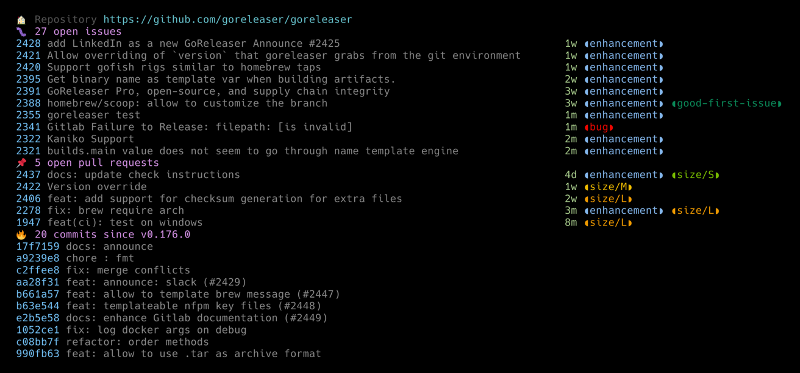

# gitty

[](https://github.com/muesli/gitty/releases)
[](https://github.com/muesli/gitty/actions)
[](https://goreportcard.com/report/muesli/gitty)
[](https://pkg.go.dev/github.com/muesli/gitty)

`gitty` is a smart little CLI helper for git projects, that shows you all the
relevant issues, pull requests and changes at a quick glance. It currently
only supports the GitHub API, but I'd eventually like it to become a bit more
agnostic.



## Installation

### Packages

#### Linux
- Arch Linux: [gitty](https://aur.archlinux.org/packages/gitty/)
- [Packages](https://github.com/muesli/gitty/releases) in Debian & RPM formats

### Binaries
- [Binaries](https://github.com/muesli/gitty/releases) for Linux, FreeBSD, OpenBSD, macOS, Windows

### From source

Make sure you have a working Go environment (Go 1.12 or higher is required).
See the [install instructions](http://golang.org/doc/install.html).

Compiling gitty is easy, simply run:

    git clone https://github.com/muesli/gitty.git
    cd gitty
    go build

## Usage

Note: `gitty` requires you to set a GitHub Token as an environment variable called
either `GITHUB_TOKEN` or `GITTY_TOKEN`.

### Basic usage

You can start `gitty` with either a path or a GitHub URL as an argument. If no
argument was provided, `gitty` will operate on the current working directory.

```bash
gitty /some/repo
```

or

```bash
gitty github.com/some/project
```

The following flags are supported:

```
  -max-branch-age int
        Max age of a branch in days to be considered active (default 28)
  -max-branches int
        Max amount of active branches to show (default 10)
  -max-commits int
        Max amount of commits to show (default 10)
  -max-issues int
        Max amount of issues to show (default 10)
  -max-pull-requests int
        Max amount of pull requests to show (default 10)
```

### Open issue or pull request in browser

If you launch `gitty` with the ID of an issue or pull request, it will open the
issue or pull request in your browser:

```bash
gitty /some/repo 42
```
